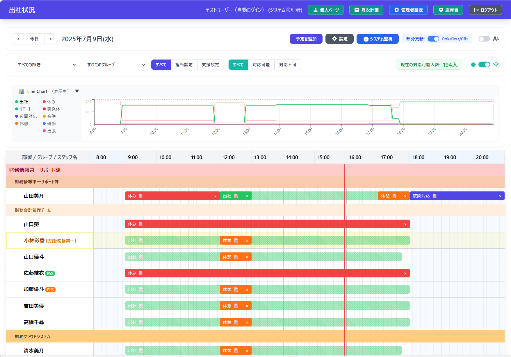
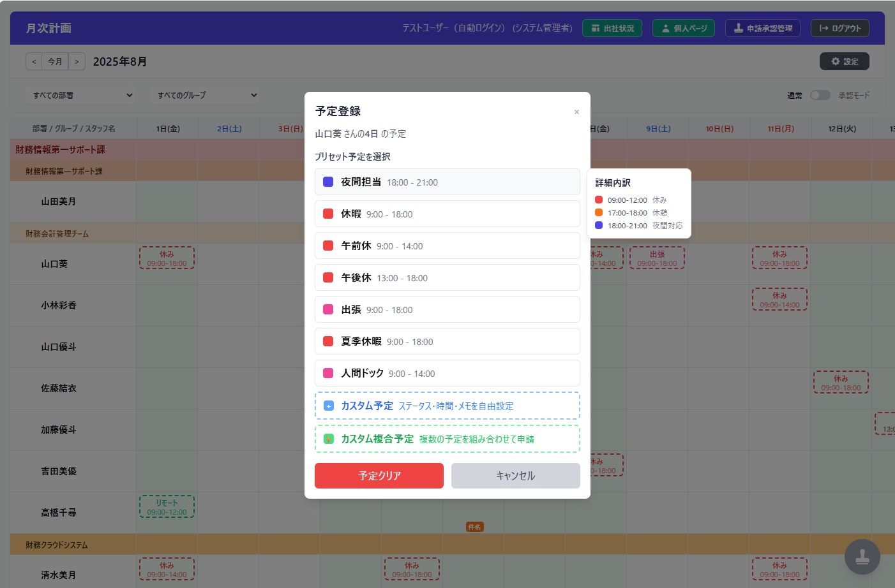
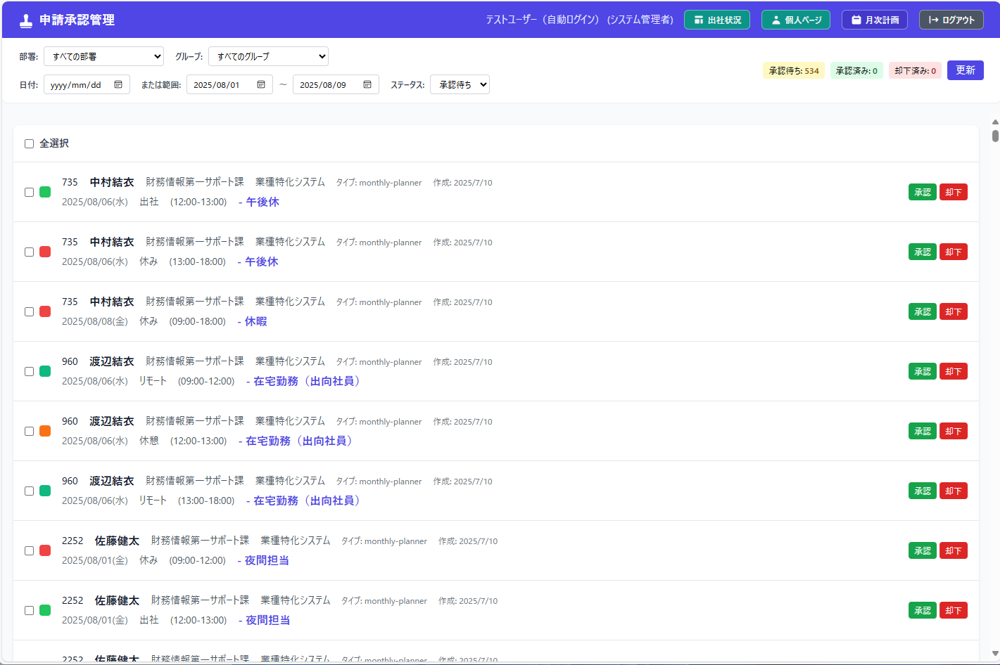

# 📊 CallStatus - Staff Schedule Management System

> **スタッフスケジュール管理システム**  
> リアルタイム同期、承認ワークフロー、データ管理機能を備えたWebアプリケーション

[](https://nextjs.org/)
[](https://nestjs.com/)
[](https://www.typescriptlang.org/)
[](https://www.postgresql.org/)
[](https://www.docker.com/)
[](https://playwright.dev/)



> ※ スクリーンショット内の人名・部署名・グループ名は全て架空のものです

### 🌐 ライブデモ（AWS環境）
- **実際の動作確認**: https://callstatus.online
- 50人規模のデモデータでの実際の動作をご確認いただけます

## 🎯 プロジェクト概要

**CallStatus**は、300名規模の企業での実際の要件に基づいて開発されたスタッフスケジュール管理システムです。  
複雑な勤務パターン、承認ワークフロー、リアルタイム更新など、実用的な業務要求に対応したアプリケーションです。

### 🏢 想定利用シーン
- **企業の勤務管理**: 複数部署・グループでの勤務時間管理
- **リアルタイム共有**: 出社状況の即座な把握
- **承認ワークフロー**: 予定変更の申請・承認プロセス
- **履歴管理**: 過去のスケジュール参照・監査対応

---

## ✨ 主要機能

### 🔄 **リアルタイム同期**
- WebSocket（Socket.io）による即座な更新通知
- 複数ユーザー間での同時編集対応
- ライブステータス表示（出社・リモート・会議等）

### 📅 **高度なスケジュール管理**
- **2層データレイヤー**: 基本契約時間 + 個別調整の組み合わせ
- **1分単位精度**: 正確な時間計算
- **複合予定**: 1日に複数の勤務パターンを組み合わせ可能
- **プリセット機能**: よく使う勤務パターンの保存・再利用

### 🔐 **エンタープライズ認証**
- JWT認証による安全なセッション管理
- 役割ベース権限制御（管理者・一般ユーザー）
- パスワードリセット・初期設定フロー

### 📋 **承認ワークフロー**
- 月次計画での予定申請
- 管理者による一括・個別承認
- 承認履歴の完全な監査ログ
- 承認待ち・承認済み状態の可視化

### 📊 **データ管理・分析**
- **履歴スナップショット**: 日次での過去データ保存
- **CSVインポート・エクスポート**: 大量データの効率的な処理
- **ロールバック機能**: インポート操作の取り消し
- **マスキング機能**: 過去データの個人情報保護

### 🎨 **Modern UI/UX**
- **実用的なデザイン**: シフト管理システムを参考にした使いやすいデザイン
- **デスクトップ最適化**: 大画面での効率的な操作を重視
- **横スクロール統一**: 大量データの効率的な表示
- **統一カードデザイン**: 一貫性のあるUI/UXパターン

---

## 🛠 技術スタック

### **Frontend**
- **Next.js 14** - App Router、RSC活用の最新構成
- **TypeScript** - 完全型安全な開発
- **Tailwind CSS** - ユーティリティファーストのスタイリング
- **Socket.io-client** - リアルタイム通信
- **React DnD** - ドラッグ&ドロップ操作

### **Backend**
- **NestJS** - エンタープライズ向けNode.jsフレームワーク
- **Prisma ORM** - 型安全なデータベースアクセス
- **PostgreSQL** - 高性能リレーショナルデータベース
- **Socket.io** - WebSocketサーバー
- **JWT** - 認証・認可システム

### **Infrastructure & DevOps**
- **Docker & Docker Compose** - コンテナ化による環境一致
- **Playwright 1.53** - E2Eテスト自動化（10カテゴリ98テストケース実装）
- **Jest** - ユニット・統合テスト
- **Playwright E2E** - 包括的自動テスト（10カテゴリ98テストケース）

### **Architecture Patterns**
- **マイクロサービス風モジュラー設計**
- **レイヤードアーキテクチャ** - 関心の分離
- **CQRS風データ操作** - 読み取り・書き込みの最適化
- **イベント駆動アーキテクチャ** - WebSocketによる状態同期

---

## 🚀 クイックスタート

### 前提条件
- Node.js 18+
- Docker & Docker Compose
- PostgreSQL（Dockerで自動セットアップ）

### インストール・起動
```bash
# リポジトリクローン
git clone https://github.com/piyo-maru/callstatus-app.git
cd callstatus-app

# 全サービス起動（初回は--buildオプション推奨）
docker-compose up -d --build

# Prismaクライアント生成（必須）
docker exec callstatus-app-backend-1 npx prisma generate

# バックエンド開発サーバー起動（バックグラウンド）
docker exec callstatus-app-backend-1 bash -c "cd /app && nohup npm run start:dev > /tmp/backend.log 2>&1 &"

# 起動待機（15秒）
sleep 15

# フロントエンド開発サーバー起動（バックグラウンド）
docker exec callstatus-app-frontend-1 bash -c "cd /app && nohup npm run dev > /tmp/frontend.log 2>&1 &"

# 起動待機（10秒）
sleep 10
```

**注意:**
- 初回起動や問題発生時は `--build` オプションを使用
- コンテナ名は `callstatus-app-backend-1`, `callstatus-app-frontend-1` に注意
- バックエンド起動には約15秒、フロントエンド起動には約10秒かかります

### 接続確認
- **フロントエンド**: http://localhost:3000
- **バックエンドAPI**: http://localhost:3002
- **PostgreSQL**: localhost:5432

---

## 📸 機能スクリーンショット

### メインダッシュボード

*リアルタイムでの出社状況表示・8:00-21:00のタイムライン表示*

### 月次計画

*カレンダー形式での月間予定管理・申請ワークフロー*

### プリセット設定

*月次計画のプリセット申請予定の選択*

### 申請承認管理

*管理者による一括承認・却下*

### 個人スケジュール

*個人向け予定編集・プリセット活用*

### ログイン画面

*ログイン画面*

---

## 🎯 ポートフォリオ用50人データセット

### 📋 概要
ポートフォリオ閲覧者向けに、50人規模のリアルなデータセットを簡単に投入できるスクリプトを用意しています。  
**動的日付対応**により、実行日から60日間の申請データを自動生成し、実際の運用環境に近い体験を提供します。

### 🚀 クイック投入（4コマンド）

```bash
# 1. 50人スタッフデータ投入（統一配色6部署・グループ）
docker exec callstatus-app-backend-1 bash -c "cd /app && node prisma/seed_portfolio.js"

# 2. 60日分申請データ生成（実行日基準・動的日付）
cd scripts/demo-data && node generate_portfolio_demo_60days.js

# 3. 申請データ投入（pending状態）
node register_portfolio_pending_60days.js

# 4. 前半30日分承認処理（承認ワークフロー体験用）
node approve_first_30days_portfolio.js
```

### 📊 データセット詳細

#### スタッフ構成（50人・ID範囲: PostgreSQL自動採番）
- **システム部** (12人): 開発グループ・インフラグループ
- **営業部** (10人): 法人営業グループ・個人営業グループ
- **管理部** (8人): 人事グループ・経理グループ
- **マーケティング部** (8人): デジタルマーケティンググループ・ブランドマーケティンググループ
- **カスタマーサポート部** (7人): テクニカルサポートグループ・カスタマーサクセスグループ
- **受付チーム** (5人): 受付グループ

#### 申請データ（60日分・動的生成）
- **平日申請**: 休暇・午前休・午後休・在宅勤務・夜間担当（13件/日）
- **土曜申請**: 振替出勤（2件/日）
- **担当設定**: FAX当番・件名チェック担当（80%確率）
- **承認状態**: 前半30日承認済み・後半30日承認待ち

### 📈 ポートフォリオ活用方法

1. **出社状況ページ**: 50人の多様な勤務状況をリアルタイム表示
2. **月次計画ページ**: 承認済み・承認待ちの予定を視覚的に確認
3. **個人スケジュール**: 各スタッフの詳細な勤務パターン
4. **承認ワークフロー**: 管理者権限での承認・却下操作体験

### ⚠️ 注意事項

- **ID範囲**: PostgreSQLの自動採番により連番で生成（過去データがあれば最大ID+1から開始）
- **日付**: 実行日から60日間の動的生成（過去データではない）
- **承認状態**: 前半30日は承認済み・後半30日は承認待ち状態
- **データ量**: 約540件の申請データ・60件の担当設定
- **リセット**: 再度seed_portfolio.jsを実行すれば新しい50人データセットで上書き可能

---

## 🧪 テスト

### E2Eテスト実行
```bash
# 全テストケース実行（10カテゴリ98テスト）
npm run test

# カテゴリ別実行
npm run test:basic        # 基本ワークフロー（8テスト）
npm run test:layers       # データレイヤー（5テスト）
npm run test:support      # 支援機能（6テスト）

# UIテスト・デバッグ
npm run test:headed       # ブラウザ表示
npm run test:ui           # Playwright UIツール
```

### バックエンドテスト
```bash
# 単体・統合テスト
docker exec callstatus-app-backend-1 bash -c \"cd /app && npm run test\"

# E2Eテスト
docker exec callstatus-app-backend-1 bash -c \"cd /app && npm run test:e2e\"

# カバレッジ測定
docker exec callstatus-app-backend-1 bash -c \"cd /app && npm run test:cov\"
```

---

## 🏗 アーキテクチャ詳細

### システム構成図
```
┌─────────────────┐    ┌─────────────────┐    ┌─────────────────┐
│   Frontend      │    │   Backend       │    │   Database      │
│   (Next.js)     │◄──►│   (NestJS)      │◄──►│  (PostgreSQL)   │
│                 │    │                 │    │                 │
│ ・App Router    │    │ ・JWT Auth      │    │ ・Prisma ORM    │
│ ・WebSocket     │    │ ・WebSocket     │    │ ・マイグレーション│
│ ・TypeScript    │    │ ・RESTful API   │    │ ・スナップショット│
└─────────────────┘    └─────────────────┘    └─────────────────┘
```

### データモデル概要
- **Staff**: スタッフ基本情報・部署・グループ
- **Contract**: 基本勤務時間（曜日別パターン）
- **Adjustment**: 個別調整予定（休暇・残業等）
- **PendingSchedule**: 承認待ち予定
- **Snapshot**: 履歴データ保存
- **AuditLog**: 操作履歴・監査証跡

### 📋 詳細技術仕様書
より詳細な技術仕様・設計思想については、こちらをご覧ください：

📖 **[Technical Specification Portfolio](docs/portfolio-specs/README.md)**
- API設計仕様（80+エンドポイント）
- データベース設計仕様（27テーブル構成）
- パフォーマンス分析・負荷テスト
- デプロイメント要件・運用設計

---

## 🔄 開発手法・プロセス

### **アジャイル開発の実践**
- **反復的開発**: 段階的機能実装（Phase 1-3）
- **継続的フィードバック**: 実際の企業要件に基づく仕様変更
- **動作するソフトウェア優先**: 常にデプロイ可能な状態を維持
- **変化への対応**: 新要求への柔軟な対応（1分単位精度・カスタム複合予定等）

### **実務要件重視の設計**
- **業務継続性優先**: 技術最適化より運用確実性を重視
- **段階的実装**: 認証システム・権限管理の段階的有効化
- **ユーザーストーリー駆動**: 受付チーム要件等の実際の業務要求対応

---

## 📈 パフォーマンス・スケーラビリティ

### 想定スケール
- **300名企業対応**: 実際の企業環境を想定した設計
- **1200件/月のpending処理**: 月次計画ワークフローの処理
- **1分単位精度**: 正確な時間計算

### 最適化手法
- **WebSocket最適化**: 必要な更新のみの効率的な通信
- **データベースインデックス**: 大量データでの高速検索
- **クライアントキャッシュ**: 表示設定・プリセットの高速読み込み
- **横スクロール仮想化**: 大量データ表示での滑らかなUX

---

## 🔧 開発・運用

### 開発者向けコマンド
```bash
# データベース操作
docker exec callstatus-app-backend-1 bash -c \"cd /app && npx prisma migrate dev\"
docker exec callstatus-app-backend-1 bash -c \"cd /app && npm run db:seed\"

# コード品質チェック
docker exec callstatus-app-frontend-1 bash -c \"cd /app && npm run lint\"
docker exec callstatus-app-backend-1 bash -c \"cd /app && npm run format\"

# 型チェック
docker exec callstatus-app-frontend-1 bash -c \"cd /app && npx tsc --noEmit\"
```

### 運用スクリプト
- **scripts/operations/**: システム起動・診断ツール
- **scripts/database/**: データベース操作・メンテナンス
- **scripts/demo-data/**: テスト用データ生成

---

## 🤝 Contributing

1. フォークして機能ブランチ作成
2. コード変更・テスト追加
3. Linter・型チェック・テスト実行
4. プルリクエスト作成

### 品質基準
- **TypeScript**: 完全な型安全性
- **テスト**: 新機能には必ずテスト追加
- **ドキュメント**: APIリファレンス更新
- **パフォーマンス**: 大量データでの動作確認

---

## 📋 今後の計画

### Phase 1: 機能拡張
- [ ] モバイルアプリ対応（中継フロントエンドサーバー経由でネットワーク制約解決）
- [ ] 通知システム（Push・Email）
- [ ] 詳細分析ダッシュボード

### Phase 2: エンタープライズ機能
- [ ] GitHub Actions CI/CDパイプライン
- [ ] SSO統合（SAML/OAuth）
- [ ] API レート制限・監視

### Phase 3: AI・自動化
- [ ] 勤務パターン学習・推奨
- [ ] 異常検知・アラート
- [ ] スケジュール最適化アルゴリズム

---

## 📄 ライセンス

MIT License - 詳細は[LICENSE](LICENSE)をご覧ください。

---

## 👤 開発者情報

**Atsushi Machida**
- GitHub: [@piyo-maru](https://github.com/piyo-maru)

### 💼 転職活動について
このプロジェクトは実際の企業要件に基づいた開発経験を示すポートフォリオです。  
**実際の業務要件への対応・システム設計・開発プロセス**の経験をご確認いただけます。

---