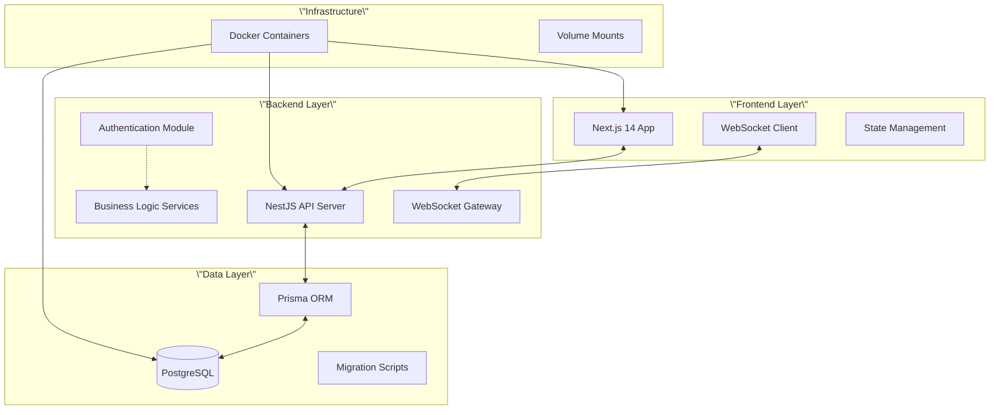

# 🏗 システムアーキテクチャ

## 📋 目次
- [概要](#概要)
- [システム構成](#システム構成)
- [データモデル](#データモデル)
- [API設計](#api設計)
- [フロントエンド設計](#フロントエンド設計)
- [セキュリティ](#セキュリティ)
- [パフォーマンス最適化](#パフォーマンス最適化)

---

## 概要

CallStatusは**エンタープライズ級のスケジュール管理システム**として設計されており、以下の原則に基づいて構築されています：

### 🎯 設計原則
- **スケーラビリティ**: 225名→数千名規模まで対応可能
- **モジュラリティ**: 機能別の明確な分離とマイクロサービス風設計
- **型安全性**: TypeScript完全活用による開発時エラー防止
- **リアルタイム性**: WebSocketによる即座な状態同期
- **監査可能性**: 全操作の完全なログ・履歴保持

---

## システム構成

### 🔄 全体アーキテクチャ図



### 🐳 コンテナ構成

```yaml
# docker-compose.yml構成
services:
  frontend:     # Next.js 14 (Port: 3000)
  backend:      # NestJS API (Port: 3002)
  database:     # PostgreSQL (Port: 5432)
  
volumes:
  postgres_data:  # データ永続化
  node_modules:   # 依存関係キャッシュ
```

---

## データモデル

### 🗂 主要エンティティ

#### 1. **Staff（スタッフ管理）**
```prisma
model Staff {
  id         Int    @id @default(autoincrement())
  empNo      String @unique  // 社員番号
  name       String          // 氏名
  department String          // 部署
  group      String          // グループ/チーム
  isActive   Boolean @default(true)
  
  // リレーション
  contracts    Contract[]
  adjustments  Adjustment[]
  @@map(\"staff\")
}
```

#### 2. **Contract（基本勤務契約）**
```prisma
model Contract {
  id          Int    @id @default(autoincrement())
  staffId     Int
  
  // 曜日別勤務時間（JSON形式）
  mondayHours    String?  // \"09:00-18:00\"
  tuesdayHours   String?
  // ... 他の曜日
  
  staff       Staff  @relation(fields: [staffId])
  @@map(\"contracts\")
}
```

#### 3. **Adjustment（個別調整予定）**
```prisma
model Adjustment {
  id          Int      @id @default(autoincrement())
  staffId     Int
  date        DateTime
  status      String   // \"online\", \"remote\", \"off\" etc.
  start       DateTime
  end         DateTime
  memo        String?
  
  // Pending System
  isPending   Boolean  @default(false)
  pendingType String?  // \"monthly-planner\", \"manual\"
  approvedBy  Int?
  approvedAt  DateTime?
  
  staff       Staff    @relation(fields: [staffId])
  @@map(\"adjustments\")
}
```

### 🔄 データフロー

```
1. 基本勤務時間（Contract）
   ↓
2. 個別調整（Adjustment）
   ↓
3. 統合表示（Unified API）
   ↓
4. リアルタイム更新（WebSocket）
```

---

## API設計

### 🛣 RESTful API構成

#### **認証・権限管理**
```typescript
POST   /api/auth/signin     # ログイン
POST   /api/auth/refresh    # トークン更新
DELETE /api/auth/signout    # ログアウト
```

#### **スケジュール管理**
```typescript
GET    /api/schedules/unified        # 統合スケジュール取得
POST   /api/schedules                # 新規予定作成
PUT    /api/schedules/:id            # 予定更新
DELETE /api/schedules/:id            # 予定削除
```

#### **Pendingワークフロー**
```typescript
GET    /api/pending                  # 承認待ち一覧
POST   /api/pending                  # 新規申請
PUT    /api/pending/:id/approve      # 承認
PUT    /api/pending/:id/reject       # 却下
POST   /api/pending/bulk-approval    # 一括承認
```

### 🔌 WebSocket Events

```typescript
// サーバー → クライアント
\"schedule-updated\"     # スケジュール更新通知
\"pending-created\"      # 新規申請通知
\"approval-status\"      # 承認状態変更通知

// クライアント → サーバー
\"join-room\"           # ルーム参加
\"leave-room\"          # ルーム退出
```

---

## フロントエンド設計

### 🧩 コンポーネント階層

```
src/app/
├── components/           # 共通コンポーネント
│   ├── timeline/        # タイムライン表示
│   ├── modals/          # モーダルダイアログ
│   └── utils/           # ユーティリティ
├── hooks/               # カスタムフック
├── pages/               # ページコンポーネント
└── utils/               # ヘルパー関数
```

### 🎨 状態管理戦略

#### **Local State（useState）**
- コンポーネント内の一時的な状態
- フォーム入力・UI状態

#### **Global State（Context + useReducer）**
- 認証情報
- ユーザー設定
- WebSocket接続状態

#### **Server State（SWR/React Query的パターン）**
- API取得データのキャッシュ
- 楽観的更新
- エラーハンドリング

### 🔄 データフェッチング戦略

```typescript
// 例：統合スケジュール取得
const useSchedules = (date: string) => {
  const [schedules, setSchedules] = useState([]);
  const [loading, setLoading] = useState(true);
  
  useEffect(() => {
    fetchSchedules(date)
      .then(setSchedules)
      .finally(() => setLoading(false));
  }, [date]);
  
  return { schedules, loading };
};
```

---

## セキュリティ

### 🔐 認証・認可

#### **JWT実装**
```typescript
// トークン構造
{
  \"sub\": \"user_id\",
  \"email\": \"user@example.com\",
  \"role\": \"admin\" | \"user\",
  \"exp\": 1234567890
}
```

#### **権限チェック**
```typescript
@UseGuards(JwtAuthGuard, RolesGuard)
@Roles('admin')
@Put('schedules/:id')
async updateSchedule() {
  // 管理者のみアクセス可能
}
```

### 🛡 セキュリティ対策

1. **SQLインジェクション**: Prisma ORMによる自動エスケープ
2. **XSS**: サニタイゼーション・CSP実装
3. **CSRF**: SameSite Cookieとトークン検証
4. **認証**: JWT + リフレッシュトークン
5. **権限**: Role-based Access Control (RBAC)

---

## パフォーマンス最適化

### ⚡ フロントエンド最適化

#### **レンダリング最適化**
```typescript
// React.memo でコンポーネント最適化
const ScheduleItem = React.memo(({ schedule }) => {
  return <div>{schedule.name}</div>;
});

// useMemo で計算キャッシュ
const sortedSchedules = useMemo(() => 
  schedules.sort((a, b) => a.start - b.start),
  [schedules]
);
```

#### **バンドル最適化**
- Tree shaking による未使用コード除去
- Dynamic import による遅延読み込み
- CDN活用による配信最適化

### 🗃 データベース最適化

#### **インデックス戦略**
```sql
-- 日付・スタッフIDの複合インデックス
CREATE INDEX idx_schedules_date_staff 
ON adjustments(date, staff_id);

-- 承認状態検索用インデックス
CREATE INDEX idx_pending_status 
ON adjustments(is_pending, approved_at);
```

#### **クエリ最適化**
- JOIN最小化によるN+1問題解決
- SELECT句の必要カラムのみ指定
- ページネーション実装

### 🔄 リアルタイム最適化

#### **WebSocket効率化**
```typescript
// 必要な更新のみ送信
if (changedFields.length > 0) {
  this.server.emit('schedule-updated', {
    scheduleId,
    changes: changedFields
  });
}
```

---

## 🔮 スケーラビリティ考慮

### 📈 水平スケーリング対応

1. **ステートレス設計**: セッション情報をJWTで管理
2. **データベース分散**: 読み取り専用レプリカ対応準備
3. **キャッシュ層**: Redis導入準備
4. **CDN対応**: 静的アセット配信最適化

### 🔧 運用・監視

1. **ログ管理**: 構造化ログによる検索・分析
2. **メトリクス**: APMツール連携準備
3. **エラートラッキング**: Sentry等の導入準備
4. **ヘルスチェック**: アプリケーション死活監視

---

このアーキテクチャにより、**エンタープライズ環境での大規模運用**に耐えうる堅牢で拡張性の高いシステムを実現しています。